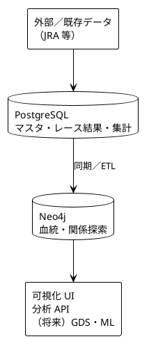

# 01 R&D — 要求仕様・要件

競走馬の血統をグラフデータとして管理・ビジュアライズするシステムの、R&D 段階における要求仕様・要件をまとめる。

## 背景

競走馬の血統は「馬（ノード）× 親子関係（エッジ）」の典型的なグラフ構造である。RDB では多段 JOIN になりがちな、5代血統探索・母系追跡・インブリード（クロス）検出・系統クラスタなどは、グラフDBの方が自然に表現・高速に探索できる。

本プロジェクトでは、既存のリレーショナルデータ（想定: PostgreSQL）をソースとし、グラフDB（想定: Neo4j）上で血統ネットワークを管理し、可視化・分析に供することを目指す。

## 文書構成

| 文書 | 内容 |
| ---- | ---- |
| [requirements.md](./requirements.md) | 要求仕様・機能要件・非機能要件・データ要件・スコープ |
| [use_cases.md](./use_cases.md) | 主要ユースケースと画面・操作の想定 |

設計書（アーキテクチャ・ベース設計・データモデル・動作環境）は [../02_design](../02_design) を参照。

## 関連調査メモ

- [血統分析の観点](../research/blood_analytics.md)
- [Neo4j 概説](../research/neo4j.md)
- [PostgreSQL → Neo4j 変換手順](../research/posgre2neo4j.md)

## 現時点の方針（仮説）

- **PostgreSQL**: 馬マスタ、レース結果、数値集計
- **Neo4j**: 血統ツリー、母系、クロス、系統ネットワーク
- **可視化**: 血統表（5代中心）＋グラフ探索ビュー

詳細な技術選定・実装設計は本フォルダの要件を満たす前提で、以降の設計フェーズで確定する。
