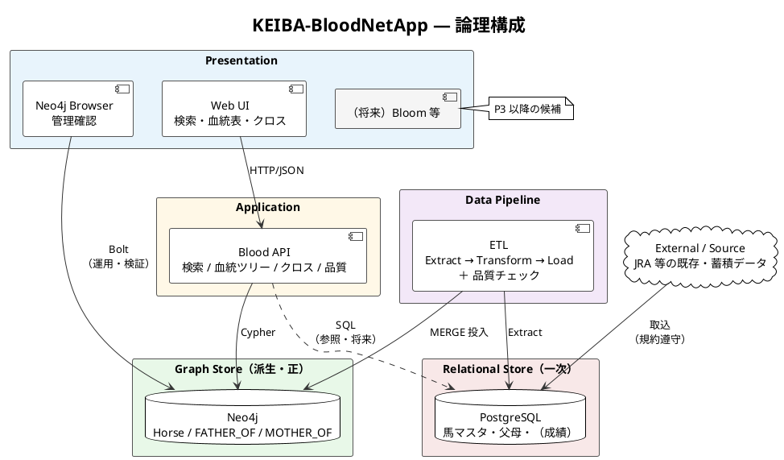
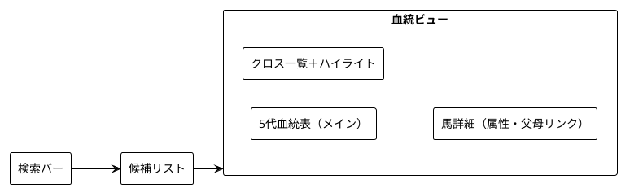
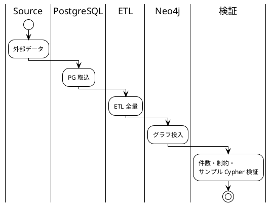
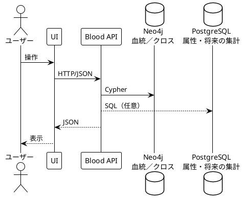
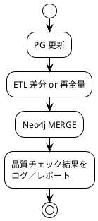
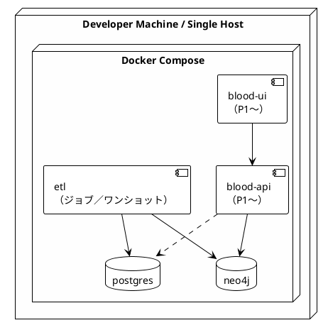

# アーキテクチャ設計

要求仕様（[../01_rd/requirements.md](../01_rd/requirements.md)）とユースケース（[../01_rd/use_cases.md](../01_rd/use_cases.md)）を満たすためのシステム構成。

データモデルの詳細は [data_model.md](./data_model.md)、コンポーネント責務・API・画面の基本設計は [base_design.md](./base_design.md)、ホスト／ミドルウェア／Compose は [environment.md](./environment.md) を参照。

---

## 1. 設計方針

| 方針 | 内容 |
| ---- | ---- |
| 二層ストア | PostgreSQL を一次ストア（マスタ・将来の成績）、Neo4j を血統探索・可視化の正とする |
| グラフは派生 | Neo4j はソースから再構築可能な派生ストア。ETL の冪等性を必須とする |
| 血統中心 | 初期は Horse と父母リレーションに集中。レース・人・牧場はスキーマ破壊なしで追加可能にする |
| ローカル優先 | 開発・MVP は Docker Compose による単一インスタンス。高可用性は対象外 |
| 段階的 UI | P1 は検索＋5 代血統表＋クロス。グラフ探索ビュー等は P2 以降 |

---

## 2. 論理構成

---

## 3. コンポーネント

### 3.1 PostgreSQL（一次ストア）

| 責務 | 内容 |
| ---- | ---- |
| 保持 | 馬マスタ、父母 ID、基本属性。レース結果・集計は当面ここに残す |
| 役割 | ソース・オブ・トゥルース（マスタ属性）。グラフ再構築の入力 |
| 非責務 | N 代祖先探索・クロス検出の主処理（グラフ側に委譲） |

### 3.2 Neo4j（グラフストア）

| 責務 | 内容 |
| ---- | ---- |
| 保持 | `:Horse` と父母リレーション（[data_model.md](./data_model.md)） |
| 役割 | 5 代血統、父系／母系、クロス、子孫展開の実行基盤 |
| 非責務 | 大量の数値集計の一次保管（必要なら PG 集計＋ `horse_id` 接合） |

### 3.3 ETL / 同期パイプライン

| 責務 | 内容 |
| ---- | ---- |
| 抽出 | PG から馬・父母関係を抽出（CSV / 直接ドライバ） |
| 変換 | ノード・リレーション形へ整形。MERGE キーは `horse_id` |
| 投入 | 初期は全量、Should で差分同期 |
| 品質 | 重複、父母欠落率、循環をレポート（UC-06 / UC-07） |

投入手段の候補（実装選定はベース設計で固定）:

1. **neo4j-admin import** … 大規模初期構築向け（停止前提）
2. **LOAD CSV / Cypher MERGE** … 開発・中規模・再実行向け
3. **アプリ／スクリプト（Python 等）** … PG 直読＋Bolt 投入の自動化

### 3.4 Blood API

| 責務 | 内容 |
| ---- | ---- |
| 検索 | 馬名部分一致・`horse_id`（F-API-01） |
| 血統 | N 代ツリーを構造化 JSON で返却（F-API-02） |
| クロス | 祖先 × 世代表記（例: 4×4）の一覧（F-API-03） |
| 可視化向け | UI がそのまま消費できるレスポンス形（F-API-04） |
| 運用 | （Should）品質点検エンドポイントまたは CLI 出力 |

API は Neo4j を主に読み、属性補完や将来の成績接合で PG を参照しうる。クライアントは Cypher を直接書かない。

### 3.5 Web UI

論理画面（UC 対応）:

| フェーズ | UI 範囲 |
| -------- | ------- |
| P1 | 検索、5 代表、クロス一覧・ハイライト、詳細パネル |
| P2 | グラフ探索ビュー（ズーム／パン）、品質ダッシュ（任意） |
| P3 | 母系／号族、2 頭比較、系統可視化 |

### 3.6 管理系 UI（Should）

Neo4j Browser（および将来 Bloom）で投入結果・Cypher 検証を直接確認する。製品 UI の代替ではなく、開発・運用補助。

---

## 4. データフロー

### 4.1 初期投入（P0）

### 4.2 参照（P1〜）

### 4.3 更新（P2〜）

同期方針の既定: **バッチ再構築／差分で足りる**（リアルタイム同期は初期非目標）。未決事項は requirements の「未決事項」に従い、必要になった時点で見直す。

---

## 5. 横断関心事

### 5.1 識別子・整合性（NF-05）

- `horse_id` を PG と Neo4j の突合キーとする
- MERGE は `horse_id` 基準。名称ゆれでノードを増やさない

### 5.2 性能（NF-01 / NF-02）

- 5 代取得・5 代内クロスは深さ制限付きクエリでインタラクティブ応答を目標
- `horse_id` UNIQUE、`name` 検索用インデックスを必須化
- 数十万ノード級を前提に、無制限グラフ展開は API／UI で禁止

### 5.3 再現性・運用（NF-04 / NF-06）

- ETL 手順・スキーマ・制約作成順を文書化し、同一ソースから再構築可能にする
- Docker Compose で PG / Neo4j /（API）/（UI）をローカル起動可能にする

### 5.4 セキュリティ（NF-07）

- 認証情報は環境変数／シークレット管理。リポジトリに含めない
- 初期はローカル／閉域。公開 UI・認証方式は未決

### 5.5 拡張性（NF-08）

- 新ラベル（`:Race` 等）・新リレーションの追加を許容するスキーマ方針
- 成績系は「PG 集計＋グラフ ID 連携」を第一候補とし、グラフへの過剰投入を避ける

---

## 6. デプロイメント（初期）

バージョン・ポート・メモリ・構築手順の正は [environment.md](./environment.md)。ここでは論理配置のみ示す。

| 項目 | 初期方針 |
| ---- | -------- |
| 可用性 | 単一インスタンス（NF-09） |
| バックアップ | PG ダンプ＋ Neo4j 再投入手順で代替可 |
| 監視 | ログ中心。本格 APM は対象外 |

---

## 7. フェーズとアーキテクチャの対応

| フェーズ | アーキテクチャ上の到達点 |
| -------- | ------------------------ |
| P0 | PG＋Neo4j＋ETL。Cypher で 5 代・クロス検証。API／UI なし可 |
| P1 | Blood API＋最小 UI。検索〜血統表〜クロスハイライト（MVP） |
| P2 | 差分同期、品質チェック、グラフ探索ビュー |
| P3 | 母系／号族、兄弟、成績接合、GDS／類似探索 |

MVP 受け入れ（requirements §7）は **P1 完了** と対応する。

---

## 8. 技術選定の位置づけ

本ドキュメントは論理アーキテクチャを固定する。具体的な言語・FW・ライブラリは [base_design.md](./base_design.md) で仮決めし、実装設計で確定する。

既定の技術仮説（R&D README 準拠）:

| 領域 | 第一候補 | 備考 |
| ---- | -------- | ---- |
| RDB | PostgreSQL 16 系 | 一次ストア。イメージは environment で固定 |
| グラフ DB | Neo4j 5.26 LTS Community | 代替は設計レビューで可。Bloom/GDS は P3 |
| ETL | Python 3.12+ または LOAD CSV | 再現性優先 |
| API | （未確定）REST/JSON | Cypher 隠蔽。ポート 8000 |
| UI | （未確定）SPA 想定 | 技術非依存要件を満たせば可。ポート 5173 |
| 基盤 | Docker Compose | NF-06。`infra/docker/compose.yaml` |

---

## 9. 関連文書

| 文書 | 役割 |
| ---- | ---- |
| [base_design.md](./base_design.md) | モジュール境界、API、画面、ETL の基本設計 |
| [data_model.md](./data_model.md) | ノード／リレーション／インデックス |
| [environment.md](./environment.md) | 動作環境・開発環境構築 |
| [../research/neo4j.md](../research/neo4j.md) | Neo4j 調査 |
| [../research/posgre2neo4j.md](../research/posgre2neo4j.md) | PG→Neo4j 変換手順メモ |
| [../research/blood_analytics.md](../research/blood_analytics.md) | 血統分析観点 |
