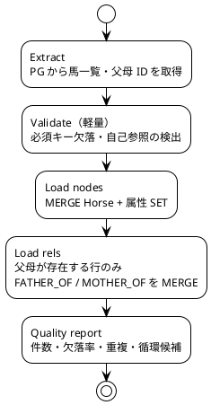

# ベース設計（基本設計）

アーキテクチャ（[architecture.md](./architecture.md)）を実装可能な粒度に落とした基本設計。  
要求 ID（F-＊ / NF-＊）は [../01_rd/requirements.md](../01_rd/requirements.md)、画面・操作は [../01_rd/use_cases.md](../01_rd/use_cases.md) に対応する。

グラフスキーマの詳細は [data_model.md](./data_model.md)。

---

## 1. スコープ

### 1.1 対象（初期〜P1）

- 馬マスタ・父母関係の PG → Neo4j 投入
- 馬検索、N 代（既定 5）血統ツリー API
- 5 代内クロス検出 API と UI ハイライト
- ローカル Docker での再現可能な開発環境

### 1.2 非対象（初期）

- 出走予想・投票連携
- リアルタイム同期
- 公開認証・マルチテナント
- 系統クラスタ／GDS（Could）

---

## 2. 技術スタック（仮決め）

実装設計で変更可。変更時は本表と architecture を更新する。

| 層 | 仮決め | 選定理由 |
| -- | ------ | -------- |
| PostgreSQL | 16 系（`postgres:16-alpine`） | 既存／蓄積データの一次ストア。[environment.md](./environment.md) |
| Neo4j | 5.26 LTS Community（`neo4j:5.26`） | 血統グラフ・Cypher・調査メモ準拠 |
| ETL | Python 3.12+ ＋ 公式 Neo4j ドライバ（または LOAD CSV） | PG 直結・冪等 MERGE・手順の文書化が容易 |
| API | Python（FastAPI 等）または同等の REST | JSON API、型付きスキーマ、ローカル起動が容易 |
| UI | TypeScript ＋ SPA（React / Vue 等、実装時確定） | 血統表レイアウトと検索 UX。Node.js 22 LTS 以上 |
| 基盤 | Docker Compose（`infra/docker/compose.yaml`） | NF-06 |

認証情報は `.env`（gitignore）または Compose secrets。リポジトリにパスワードを置かない（NF-07）。

---

## 3. 論理モジュール

```text
apps/
  api/          … Blood API
  ui/           … Web UI
jobs/
  etl/          … PG → Neo4j 投入・品質チェック
infra/
  docker/       … Compose、初期化
docs/           … 本設計群（既存 doc/）
```

配置はリポジトリ実装時に合わせてよい。責務境界は次を守る。

| モジュール | 責務 | 依存 |
| ---------- | ---- | ---- |
| etl | 抽出・変換・投入・品質レポート | PG, Neo4j |
| api | ユースケース用クエリのカプセル化、DTO 返却 | Neo4j（主）, PG（任意） |
| ui | 検索・血統表・クロス表示。ビジネスロジックを持たない | api のみ |
| infra | コンテナ・ボリューム・ヘルスチェック | — |

UI から Neo4j へ直接接続しない（管理用 Browser を除く）。

---

## 4. データ設計の決定事項

詳細スキーマは [data_model.md](./data_model.md)。ベース設計としての採用案を固定する。

### 4.1 リレーション向き（決定）

**案 A（親 → 子）を採用する。**

```text
(父)-[:FATHER_OF]->(子)
(母)-[:MOTHER_OF]->(子)
```

| 観点 | 理由 |
| ---- | ---- |
| 産駒・系統展開 | 種牡馬から `FATHER_OF*` で自然 |
| 祖先探索 | 逆方向（`<-[:FATHER_OF|MOTHER_OF]-`）で N 代取得 |
| 調査メモ整合 | research / Neo4j 解説の表記と一致 |

data_model.md の案 B は不採用。実装・Cypher 例は案 A に揃える。

### 4.2 キー・制約

| 項目 | 内容 |
| ---- | ---- |
| 主キー | `Horse.horse_id` UNIQUE |
| 父母Cardinality | 子あたり父・母リレーションは各高々 1（アプリ／ETL で保証） |
| 欠落 | 不明な父母はリレーションなし（ダミーノード禁止） |
| 名前検索 | `name` にインデックス（必要なら全文は後続） |

### 4.3 PG 論理ソース（最小）

| 論理テーブル／抽出 | 用途 |
| ------------------ | ---- |
| horses(`horse_id`, `name`, `sex`, `birth_year`, …) | ノード |
| horses.`father_id` / `mother_id` または pedigree 表 | リレーション |

実テーブル名はソースに合わせる。ETL は論理カラムへのマッピング設定を持つ。

---

## 5. ETL 基本設計

対応: F-DM-01〜06、UC-06、UC-07、NF-04。

### 5.1 処理ステップ



### 5.2 冪等性

- 同一ソースの再実行でノード／リレーションが増殖しないこと
- 属性更新はソース正で上書き（最終同期時刻をプロパティに持てるとよい: `synced_at`）

### 5.3 初期モード

| モード | 用途 | 手段の目安 |
| ------ | ---- | ---------- |
| full | P0 初期構築・壊れたときの再構築 | admin import または 全 MERGE |
| incremental（Should） | P2 差分 | 更新日／ID リストで対象限定 MERGE |

### 5.4 品質チェック項目

| チェック | 重大度 |
| -------- | ------ |
| `horse_id` 重複 | Error |
| 名称未設定 | Warning |
| 父母欠落率（レポート） | Info |
| 循環（自己が祖先） | Error（報告。自動切断はしない） |
| 孤児（参照先 horse_id 不在でリレーション未作成） | Warning |

出力は標準出力／JSON レポート。API 化は P2 で可。

---

## 6. API 基本設計

対応: F-API-01〜04、F-EX-01〜05、F-VZ 系のデータ供給。

ベースパス仮: `/api/v1`  
形式: JSON。エラーは HTTP ステータス＋ `{ "error": { "code", "message" } }`。

### 6.1 エンドポイント一覧（P1）

| Method | Path | 要件 | 概要 |
| ------ | ---- | ---- | ---- |
| GET | `/horses` | F-API-01 | 検索。`q`（名前部分一致）または `horse_id` |
| GET | `/horses/{horse_id}` | F-VZ-05 | 馬詳細（属性＋直近父母） |
| GET | `/horses/{horse_id}/pedigree` | F-API-02, F-EX-01 | N 代血統ツリー。`generations` 既定 5 |
| GET | `/horses/{horse_id}/crosses` | F-API-03, F-EX-04/05 | 指定世代内クロス一覧 |
| GET | `/horses/{horse_id}/sire-line` | F-EX-02 | 父系ライン（P1 で実装推奨） |
| GET | `/horses/{horse_id}/dam-line` | F-EX-03 | 母系ライン（P1 で実装推奨） |

P2 候補: `/horses/{id}/offspring`、`/compare?a=&b=`、`/quality/report`。

### 6.2 検索 `GET /horses`

| クエリ | 説明 |
| ------ | ---- |
| `q` | 名前部分一致 |
| `horse_id` | 完全一致 |
| `limit` | 既定 20、上限あり |

レスポンス要素: `horse_id`, `name`, `sex`, `birth_year`。

### 6.3 血統ツリー `GET /horses/{horse_id}/pedigree`

**目的**: 5 代血統表を完全二分木（父母）として描画できる構造を返す。

論理形（イメージ）:

```json
{
  "horse_id": "…",
  "name": "…",
  "generations": 5,
  "root": {
    "horse_id": "…",
    "name": "…",
    "sex": "牡",
    "side": "root",
    "generation": 0,
    "sire": { "…": "再帰、欠落は null" },
    "dam": { "…": "再帰、欠落は null" }
  }
}
```

| フィールド | 意味 |
| ---------- | ---- |
| `generation` | 起点からの世代（0=本人） |
| `side` | `root` / `sire` 側経路 / `dam` 側経路（ハイライト・配色用。実装でパス符号でも可） |
| `sire` / `dam` | 父・母サブツリー。データなしは `null` |

深さ制限必須。`generations > 上限`（例: 8）は 400。

### 6.4 クロス `GET /horses/{horse_id}/crosses`

| クエリ | 説明 |
| ------ | ---- |
| `generations` | 既定 5 |

レスポンス要素（最低限）:

| 項目 | 例 |
| ---- | -- |
| `ancestor_horse_id` / `ancestor_name` | Northern Dancer |
| `notation` | `"4×4"` |
| `occurrences` | 各出現の世代と父側／母側の区別 |

UI は `ancestor_horse_id` 集合で血統表マスをハイライトする（F-VZ-03）。

### 6.5 父系・母系

順序付き祖先配列を返す。

- 父系: 父 → 父父 → …（`FATHER_OF` 逆方向のみ）
- 母系: 母 → 母母 → …
- BMS: 詳細または母系応答の付帯として「母の父」を含めてよい（F-EX-03）

---

## 7. UI 基本設計

対応: F-VZ-01〜03, 06、UC-01〜03。技術非依存の論理設計。

### 7.1 画面

| 画面 | 内容 | UC |
| ---- | ---- | -- |
| 検索 | 検索バー、候補リスト、選択で血統ビューへ | UC-01 |
| 血統ビュー | 5 代表（メイン）＋クロス一覧＋詳細パネル | UC-01, 02 |
| （P1）ライン | 父系／母系の列表示または詳細内リンク | UC-03 |

### 7.2 5 代血統表

| 規則 | 内容 |
| ---- | ---- |
| レイアウト | 本人を起点とした父母の完全二分木（世代列） |
| 父側／母側 | 色または位置で区別（F-VZ-02） |
| 欠損 | 空マスまたは「不明」表示。レイアウトは崩さない |
| クロス | crosses API の祖先 ID をハイライト（F-VZ-03） |
| 操作 | 祖先マス選択で詳細パネル更新、父母リンクで再検索相当の遷移 |

### 7.3 クロス一覧

表記例: `Northern Dancer 4×4`。一覧選択で該当マス強調を連動できるとよい。

### 7.4 非機能（UI）

- 初期表示は pedigree ＋ crosses を並行取得してよい
- ローディング／エラー表示を用意する
- P1 ではズーム／パン型グラフビューは必須としない（F-VZ-04 は P2）

---

## 8. クエリ方針（Neo4j）

実装詳細は別途 Cypher 設計でよい。方針のみ固定する。

| 用途 | 方針 |
| ---- | ---- |
| N 代祖先 | 深さ上限付きで父母エッジを逆方向に展開。結果を木に畳むのは API 層 |
| 父系／母系 | 単一リレーション型のみを連鎖 |
| クロス | 指定深さの祖先マルチセット（またはパス集合）から、2 回以上出現する祖先を抽出。世代組で `notation` を生成 |
| 検索 | `horse_id` 完全一致、または `name CONTAINS`（規模増大時は全文／正規化を検討） |

性能目安: 単一馬 5 代＋クロスがインタラクティブ（NF-01, NF-02）。遅い場合は深さ・結果キャッシュ・投影を検討。

---

## 9. 開発環境

詳細（ホスト要件、バージョン固定、ポート、メモリ、手順、トラブルシュート）は [environment.md](./environment.md)。

```text
docker compose --env-file infra/docker/.env -f infra/docker/compose.yaml up -d
  → PostgreSQL 127.0.0.1:5432（サンプル馬マスタを init）
  → Neo4j HTTP :7474 / Bolt :7687
  → API :8000（P1）
  → UI :5173 等（P1）
```

| 手順 | 内容 |
| ---- | ---- |
| 初回 | `.env` 作成 → Compose 起動 →（サンプルは自動投入。実データは任意）→ ETL full → Browser/API で検証 |
| 日常 | API/UI ホットリロード。グラフ破壊時は ETL full 再実行 |

---

## 10. 要件トレース（要約）

| 要件群 | 設計上の置き場 |
| ------ | -------------- |
| F-DM-＊ | ETL §5、data_model、§4 |
| F-EX-01〜05 | API §6、クエリ §8 |
| F-VZ-01〜03,06 | UI §7、pedigree/crosses |
| F-API-＊ | API §6 |
| F-AN-01 | crosses API |
| NF-01〜07 | architecture 横断 ＋ 本 §2,5,8,9 |
| MVP（requirements §7） | P0 ETL＋P1 API/UI の完了 |

Should/Could（子孫展開、2 頭比較、差分同期、グラフビュー、号族、GDS）は P2/P3。インターフェースだけ先に空けておく（§6.1 の候補パス）。

---

## 11. 未決・実装設計へ送る項目

| 項目 | 状態 |
| ---- | ---- |
| 正式 `horse_id` 体系（JV／既存 DB） | ソース確定後に ETL マッピングへ反映 |
| UI FW（React / Vue 等） | 実装キックオフで確定 |
| API 言語（FastAPI 固定か否か） | 実装キックオフで確定 |
| 号族のモデル（プロパティ vs `:Family`） | P3 手前で data_model 更新 |
| 公開 UI・認証 | 非目標のまま。必要時に architecture 改訂 |
| 差分同期のトリガ（更新日カラム有無） | PG スキーマ確認後 |

---

## 12. 改訂ルール

- 要件変更は `01_rd` を先に更新し、本設計と architecture / data_model を追随させる
- リレーション向き・`horse_id`・P1 API 形は破壊的変更になりやすいため、変更時は明示的に版を上げて記録する
