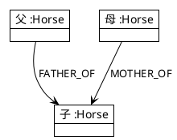

# グラフデータモデル設計

実装スキーマの確定に向けたデータモデル設計。Cypher 例はイメージであり、最終命名は実装設計で決めてよい。

要求側の要約は [../01_rd/requirements.md](../01_rd/requirements.md) の「データ要件」を参照。

## 1. 設計原則

1. **馬を中心ノード**とし、血統は親子リレーションで表現する
2. PostgreSQL と突合できる **安定キー（`horse_id`）** を必須にする
3. 初期は血統に集中し、レース・人・牧場は後からラベル追加できる形にする
4. リレーションの向きを一貫させる（探索クエリが単純になること）

---

## 2. ノード

### 2.1 Horse（必須）

| 属性 | 必須 | 説明 |
| ---- | ---- | ---- |
| horse_id | Yes | 一意キー（ソース DB と同一） |
| name | Yes | 表示名（日本語優先） |
| sex | Should | 牡／牝／セン 等 |
| birth_year | Should | 生年 |
| name_en | Could | 英名 |
| family_no | Could | 号族など母系分類 |
| is_stallion / is_broodmare | Could | 役割フラグ、またはラベルで表現 |

**ラベル例**

- `:Horse`（必須）
- `:Stallion` / `:Broodmare`（任意）

```cypher
(:Horse {
  horse_id: "…",
  name: "イクイノックス",
  sex: "牡",
  birth_year: 2019
})
```

### 2.2 拡張ノード（初期必須ではない）

| ラベル | 用途 |
| ------ | ---- |
| `:Race` | 出走・成績接合 |
| `:Jockey` / `:Trainer` / `:Farm` | 関係性分析 |
| `:SireLine` / `:Family` | 系統・号族の明示的モデル化 |

---

## 3. リレーション

### 3.1 血統（必須）

**採用: 案 A（親 → 子）** — [base_design.md](./base_design.md) §4.1 で決定。



（参考・不採用）案 B（子 → 親）: `HAS_FATHER` / `HAS_MOTHER`

**要件**

- 1 頭あたり父リンクは高々 1、母リンクは高々 1
- 不明な場合はリレーションなし（ダミーノードを作らない）
- インデックス: `horse_id` UNIQUE、必要に応じ `name`

### 3.2 拡張リレーション（将来）

```text
(:Horse)-[:RAN_IN]->(:Race)
(:Horse)-[:RIDDEN_BY]->(:Jockey)
(:Horse)-[:TRAINED_BY]->(:Trainer)
```

---

## 4. 探索要件とクエリ対応

| 要件 | モデル上の意味 |
| ---- | -------------- |
| N 代祖先 | 父母エッジを最大 N ホップ |
| 父系 | `FATHER_OF`（または `HAS_FATHER`）のみを連鎖 |
| 母系 | `MOTHER_OF`（または `HAS_MOTHER`）のみを連鎖 |
| BMS | 母の父（母経由 2 ホップ） |
| クロス | 祖先集合の交差。各出現の世代深度を保持 |
| 産駒 | 種牡馬から `FATHER_OF` の逆／順方向 |

### 4.1 クロス表現

出力は少なくとも次を含む。

| 項目 | 例 |
| ---- | -- |
| 祖先 horse_id / name | Northern Dancer |
| 出現世代の組 | 4×4、3×4 等 |
| （任意）経路 | 父系側パス／母系側パス |

---

## 5. PostgreSQL との対応（要件）

最低限、次の論理テーブル／抽出が可能であること。

| ソース概念 | グラフ側 |
| ---------- | -------- |
| horses（id, name, …） | `:Horse` ノード |
| pedigree または horses.father_id / mother_id | `FATHER_OF` / `MOTHER_OF` |

投入時は `MERGE` により冪等であること（再実行で重複が増えない）。

---

## 6. 可視化へのマッピング

| UI 要素 | データ |
| ------- | ------ |
| 5 代血統表の各マス | 祖先ノード（世代・父側/母側の座標） |
| 欠損マス | リレーションまたはノード不在 |
| クロスハイライト | クロス検出結果の祖先 ID 集合 |
| 詳細パネル | Horse プロパティ＋直近父母 |

5 代表は「完全二分木（父母）」としてレイアウトできる木構造を API が返すこと。グラフ全体の無制限展開は必須としない（深さ制限必須）。

---

## 7. インデックス・制約（要件）

- `Horse.horse_id` 一意制約
- 父母探索・名前検索に耐えるインデックス
- 大規模 import 時は制約作成順（先にノード、後にリレーション）を手順化

---

## 8. 未決（モデル）

- 号族をプロパティにするか `:Family` ノードにするか
- セン馬・海外表記ゆれの正規化方針
- 同一馬の改名履歴を持つか
