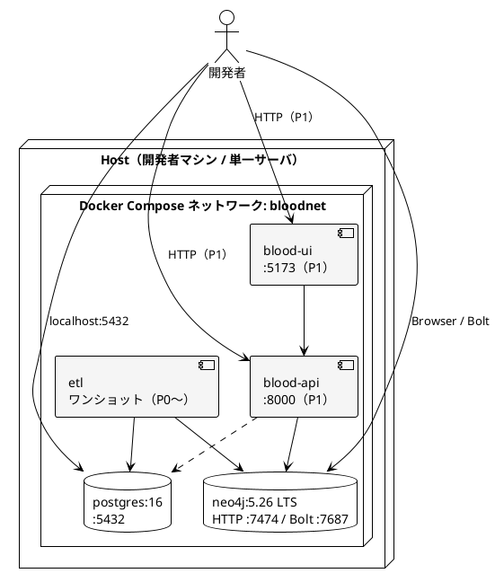

# システム動作環境・開発環境

既存の要求仕様・設計から、初期フェーズ（P0〜P1）の**システム動作環境**と**開発環境の構築方法**を確定する。

| 関連 | 文書 |
| ---- | ---- |
| 非機能（運用・セキュリティ・性能） | [../01_rd/requirements.md](../01_rd/requirements.md) §4 |
| 論理構成・デプロイ | [architecture.md](./architecture.md) §2, §6 |
| 技術仮決め・モジュール | [base_design.md](./base_design.md) §2, §3, §9 |
| グラフスキーマ | [data_model.md](./data_model.md) |
| PG→Neo4j | [../research/posgre2neo4j.md](../research/posgre2neo4j.md) |

実装時にバージョンやポートを変える場合は、本ドキュメントと `infra/docker/compose.yaml` を同じ変更で更新する。

---

## 1. 検討の前提（ドキュメントからの抽出）

要件・設計に既に書かれている制約を、環境設計の入力とする。

| ID | 出典 | 環境への含意 |
| -- | ---- | ------------ |
| NF-01 / NF-02 | 5 代血統・クロスがインタラクティブ | 深さ制限付きクエリが成立するメモリ／インデックス。無制限グラフ展開はしない |
| NF-03 | 数十万ノード級（国内サラブレッド中心） | 単一 Neo4j で足りる規模。クラスタは不要 |
| NF-04 | ETL が同一ソースから再構築可能 | 手順・Compose・初期スキーマをリポジトリで固定する |
| NF-05 | `horse_id` で PG と Neo4j を突合 | 両ストアを同一開発ホストで同時起動する |
| NF-06 | ローカル Docker で開発環境を立ち上げられる | **Docker Compose を開発環境の正とする** |
| NF-07 | 認証情報をリポジトリに含めない。初期はローカル／閉域 | `.env`、ポートはループバックにバインド |
| NF-09 | 単一インスタンス。高可用性は対象外 | レプリカ・クラスタ・ロードバランサは置かない |
| 二層ストア | PG 一次、Neo4j 派生 | 開発環境に両方必須（P0 から） |
| 外部データ | JRA 等／JV-DL。再配布制限 | 実データはリポジトリ外。サンプルは架空馬のみ |

フェーズ対応（[architecture.md](./architecture.md) §7）:

| フェーズ | 起動するもの |
| -------- | ------------ |
| P0（現時点の到達目標） | PostgreSQL、Neo4j、（任意）ETL ジョブ |
| P1 | 上記 ＋ Blood API ＋ Web UI |
| P2 以降 | 差分 ETL、品質チェック。構成の大幅変更はしない |

---

## 2. システム動作環境（初期）

初期の「本番相当」は **開発者マシンまたは単一ホスト上の Docker Compose** である。クラウド本番・HA・公開 UI は対象外（要件の未決事項）。

### 2.1 ホスト

| 項目 | 要件 |
| ---- | ---- |
| OS | Linux / macOS / Windows（WLS2 + Docker）。コンテナ内 OS はイメージに依存 |
| アーキテクチャ | amd64 または arm64（Apple Silicon 含む） |
| CPU | 4 コア以上推奨 |
| メモリ | **8 GB 以上必須、16 GB 推奨**（Neo4j ヒープ＋ページキャッシュ＋ PG＋将来の API/UI） |
| ディスク | 20 GB 以上の空き（イメージ＋ボリューム）。実データ投入後はデータ量に応じて追加 |
| ネットワーク | 初期はホストループバックのみ。外部公開しない |
| 必須ソフトウェア | Docker Engine ＋ Compose V2、Git |

コンテナオーケストレーション（Kubernetes 等）は初期対象外。

### 2.2 論理配置



ホストへ公開するポートは **127.0.0.1 にバインド**する（LAN からの到達を既定で防ぐ）。

### 2.3 ミドルウェア・ランタイム

ベース設計の「○系想定」を、再現性のため minor 系まで固定する。パッチ更新は互換の範囲で上げてよい。

| コンポーネント | バージョン | エディション | 役割 |
| -------------- | ---------- | ------------ | ---- |
| PostgreSQL | **16 系**（イメージ: `postgres:16-alpine`） | Community | 一次ストア。馬マスタ・父母 ID |
| Neo4j | **5.26 LTS**（イメージ: `neo4j:5.26`） | Community | 血統グラフの正。Browser 同梱 |
| Python | **3.12 以上**（3.13 可） | — | ETL、Blood API（P1） |
| Node.js | **22 LTS 以上**（24 LTS 可） | — | Web UI（P1）。FW は未確定 |

**Neo4j を 5.26 LTS にする理由**

- ベース設計は「5 系」。調査メモの Cypher / Browser 前提と一致する
- 2026 時点のカレント（2026.x）よりサポート期間が長く、R&D 中の破壊的変更を避ける
- Community で P0〜P1 の探索・投入は足りる。Bloom / GDS は P3 候補のため初期は入れない

**PostgreSQL を 16 系のままにする理由**

- ベース設計の一次ストア想定と一致
- 17/18 への上げはソース既存 DB と揃える必要が出たときに再検討する（本番ソースが 16 以外なら、開発もそれに合わせる）

P1 の API / UI 実装言語は未確定のまま残す（FastAPI または同等、SPA）。動作環境としては「コンテナまたはホストプロセスとして Compose から起動でき、API `:8000`・UI `:5173` を取る」ことだけを固定する。

### 2.4 ポート・プロトコル

| サービス | ホスト | コンテナ内 | プロトコル | 利用者 |
| -------- | ------ | ---------- | ---------- | ------ |
| PostgreSQL | 127.0.0.1:5432 | 5432 | TCP | ETL、（任意）API、`psql` |
| Neo4j Browser | 127.0.0.1:7474 | 7474 | HTTP | 開発者（管理確認） |
| Neo4j Bolt | 127.0.0.1:7687 | 7687 | Bolt | ETL、API、ドライバ |
| Blood API | 127.0.0.1:8000 | 8000 | HTTP/JSON | UI、curl（P1） |
| Web UI | 127.0.0.1:5173 | 5173 | HTTP | ブラウザ（P1） |

ホスト側ポートが衝突する場合は `.env` で変更する。コンテナ間はサービス名（`postgres` / `neo4j`）で名前解決する。

接続文字列の例（値は `.env` から注入。リポジトリに実パスワードを置かない）:

```text
POSTGRES_URL=postgresql://bloodnet:<password>@localhost:5432/bloodnet
NEO4J_URI=bolt://localhost:7687
NEO4J_USER=neo4j
```

コンテナ内の ETL / API からはホスト名を `postgres` / `neo4j` に読み替える。

### 2.5 リソース見積もり

想定規模: 馬ノード数十万、父母リレーションはノードあたり高々 2（[data_model.md](./data_model.md)）。この規模は Neo4j 単一インスタンスの通常レンジに収まる。

| プロセス | メモリ目安 | CPU 目安 | 永続ディスク目安 |
| -------- | ---------- | -------- | ---------------- |
| PostgreSQL | 512 MB〜1 GB | 0.5〜1 | サンプル: 数十 MB。実データ: 数 GB 未満が多い |
| Neo4j | ヒープ 1 GB ＋ ページキャッシュ 512 MB を既定 | 1〜2 | サンプル: 数百 MB。数十万ノードでも数 GB 程度を想定 |
| ETL（実行中） | 256〜512 MB | 1 | 一時 CSV を使う場合はその分 |
| API（P1） | 256〜512 MB | 0.5 | なし（状態は DB） |
| UI 開発サーバ（P1） | 256 MB | 0.25 | なし |

Neo4j の初期 JVM 設定（Compose で指定）:

| 設定 | 値 | 意図 |
| ---- | -- | ---- |
| `server.memory.heap.initial_size` | 512m | 起動を軽くする |
| `server.memory.heap.max_size` | 1G | 5 代＋クロスの対話応答（NF-01/02） |
| `server.memory.pagecache.size` | 512m | 数十万ノードの関係走査 |

実データで遅延が出る場合はヒープ／ページキャッシュを上げ、クエリ側の深さ制限を先に確認する（無制限 `*` は禁止、[base_design.md](./base_design.md) §8）。

### 2.6 ストレージ・バックアップ

| 対象 | 方式 |
| ---- | ---- |
| PostgreSQL | Docker named volume `pg_data` |
| Neo4j data / logs | named volume `neo4j_data`, `neo4j_logs` |
| Neo4j import（LOAD CSV） | named volume またはバインド `neo4j_import` |
| バックアップ（初期） | PG は `pg_dump`。Neo4j はダンプ必須とせず、**ソースからの ETL 再投入で代替**（architecture §6） |

`docker compose down -v` はボリュームごと消える。日常の停止は `-v` なし。

### 2.7 セキュリティ（初期）

| 項目 | 方針 |
| ---- | ---- |
| 資格情報 | `.env`（gitignore）。`.env.example` にプレースホルダのみ |
| 既定バインド | `127.0.0.1` |
| Neo4j 認証 | `NEO4J_AUTH` 必須。パスワードは 8 文字以上 |
| 公開 UI / SSO | 対象外。必要になったら architecture を改訂してから足す |
| 実データ | JV-DL 等はリポジトリにコミットしない（`.gitignore` の `*.csv` 等）。利用規約を遵守 |

### 2.8 初期に置かないもの

- Neo4j クラスタ、Causal Cluster、読み取りレプリカ
- Bloom（有償）、GDS プラグイン（P3）
- リバースプロキシ、TLS 終端、APM
- クラウドマネージド DB（RDS / Aura 等）

P3 で GDS を入れる場合は Neo4j イメージまたはプラグイン追加で拡張し、論理構成は変えない。

---

## 3. 開発環境の構築方法

### 3.1 ディレクトリ（設計上の配置）

[base_design.md](./base_design.md) §3 に合わせる。アプリ本体は未実装でも、インフラ骨格は先に固定する。

```text
.
├── apps/                 … P1: api / ui（未作成）
├── jobs/                 … P0〜: etl（未作成）
├── infra/docker/         … Compose・PG 初期化・環境変数例
│   ├── compose.yaml
│   ├── .env.example
│   └── postgres/init/    … 論理マスタ＋サンプル馬
├── doc/                  … 本設計群
└── README.md
```

### 3.2 前提チェック

```bash
docker version          # Engine が動いていること
docker compose version  # v2
git --version
```

Windows は WSL2 上の Docker を使う。メモリは Docker に 4 GB 以上を割り当てる（Desktop の設定）。

### 3.3 初回セットアップ

リポジトリルートで実行する。

```bash
# 1. 環境変数
cp infra/docker/.env.example infra/docker/.env
# 必要なら .env のパスワード・ポートを編集（実パスワードをコミットしない）

# 2. データストア起動（P0）
docker compose --env-file infra/docker/.env -f infra/docker/compose.yaml up -d
# または: make up

# 3. ヘルス確認
docker compose --env-file infra/docker/.env -f infra/docker/compose.yaml ps
# または: make ps
```

初回はイメージ pull と Neo4j の起動に数十秒かかることがある。`ps` で `healthy` になるまで待ってからクライアント接続する。

### 3.4 起動後の確認

**PostgreSQL**

```bash
docker compose --env-file infra/docker/.env -f infra/docker/compose.yaml exec postgres \
  psql -U bloodnet -d bloodnet -c "SELECT horse_id, name, birth_year FROM horses ORDER BY horse_id;"
```

初期化 SQL により、架空の 5 代血統（4×4 クロスを 1 件含む）が入る。実 JV-DL データではない。

**Neo4j Browser**

1. ブラウザで `http://localhost:7474` を開く
2. 接続: `bolt://localhost:7687`、ユーザ `neo4j`、パスワードは `.env` の `NEO4J_PASSWORD`
3. P0 時点ではグラフは空でよい。ETL 実装後に投入する
4. 投入後の確認例:

```cypher
MATCH (h:Horse) RETURN count(h);
MATCH (h:Horse {name: "サンプルヒーロー"})<-[:FATHER_OF|MOTHER_OF*1..5]-(a)
RETURN DISTINCT a.name;
```

### 3.5 日常操作

| 操作 | コマンド |
| ---- | -------- |
| 起動 | `docker compose --env-file infra/docker/.env -f infra/docker/compose.yaml up -d` |
| ログ | `docker compose --env-file infra/docker/.env -f infra/docker/compose.yaml logs -f` |
| 停止（データ保持） | `docker compose --env-file infra/docker/.env -f infra/docker/compose.yaml down` |
| 破棄（DB 初期化し直し） | `... down -v` のあと `up -d`。PG の `init` はボリューム新規作成時だけ走る |
| 状態 | `... ps` |

グラフを壊した場合の復旧は、PG が残っていれば ETL full 再実行（NF-04）。PG ごと捨てる場合は `down -v`。

### 3.6 P0 以降の作業順

```text
Compose で PG / Neo4j 起動
  →（任意）実データを PG にロード ※規約遵守、リポジトリ外
  → ETL full（jobs/etl、未実装）
  → Neo4j Browser で件数・5 代・クロスを Cypher 検証
  → P1: API / UI を Compose プロファイルまたは別プロセスで追加
```

ETL の投入手段は [architecture.md](./architecture.md) §3.3 の候補どおり。開発の既定は **Python ＋公式ドライバ、または LOAD CSV ＋ MERGE**（再現性優先）。`neo4j-admin import` は大規模初期構築用で、日常の再実行には使わない。

### 3.7 ホストで API / UI を動かす場合（P1）

コンテナ化前の開発でも、DB だけ Compose に載せ、アプリはホストでホットリロードしてよい。

| 変数 | ホストから見た値 |
| ---- | ---------------- |
| `POSTGRES_HOST` | `localhost` |
| `NEO4J_URI` | `bolt://localhost:7687` |
| API origin（UI） | `http://localhost:8000` |

UI は API 以外に接続しない（Neo4j 直結禁止。Browser は管理用途のみ）。

### 3.8 トラブルシュート

| 症状 | 確認 |
| ---- | ---- |
| ポート使用中 | `ss -ltnp` 等で 5432/7474/7687。`.env` のホストポートを変更 |
| Neo4j が unhealthy のまま | 初回は 1 分程度待つ。パスワードが 8 文字未満だと起動失敗することがある |
| `psql` 認証失敗 | `.env` 変更後に古い `pg_data` が残っていないか。変更したら `down -v` |
| Browser で接続できない | `127.0.0.1:7474` を使う。バインドをループバックにしている |
| Apple Silicon でイメージが無い | 公式 `postgres` / `neo4j` は arm64 対応。`platform` 指定は通常不要 |

---

## 4. データ取り扱い（開発時）

| 種別 | 置き場 | Git |
| ---- | ------ | --- |
| 架空サンプル（init SQL） | `infra/docker/postgres/init/` | 含める |
| JV-DL 等の実ファイル | リポジトリ外、または gitignore されるパス | **含めない** |
| 変換途中の CSV | Neo4j `import` ボリューム / `/tmp` | 含めない |

馬 ID 体系がソース確定後に変わる場合は、init SQL の論理カラム（`horse_id`, `father_id`, `mother_id`）はそのままに、ETL マッピングだけを更新する（base_design 未決事項）。

---

## 5. 要件トレース

| 要件 | 本環境での実現 |
| ---- | -------------- |
| NF-04 再現性 | Compose ＋ init SQL ＋本手順 |
| NF-06 Docker 開発環境 | `infra/docker/compose.yaml` |
| NF-07 秘密情報・閉域 | `.env`、`127.0.0.1` バインド |
| NF-09 単一インスタンス | サービス各 1 つ |
| UC-06 投入 | PG 起動済みが前提。ETL は jobs で後続 |
| MVP §7 | P0 環境の上に ETL＋ P1 API/UI |

---

## 6. 未決（環境）

| 項目 | 状態 |
| ---- | ---- |
| ソース PG が 16 以外の場合のバージョン揃え | ソース確定後 |
| API コンテナ化 vs ホスト実行 | P1 キックオフ |
| UI の Node 版・FW | 実装時 |
| CI 上での Compose（サービスコンテナ） | テスト導入時 |
| 共有検証サーバ | 初期は個人ローカルのみ |
